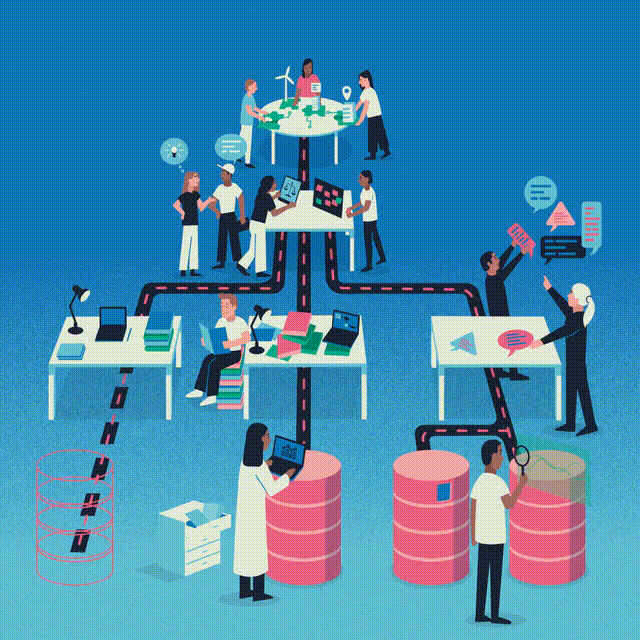

# Trustworthy and Ethical Assurance Platform



[](https://assuranceplatform.azurewebsites.net/)
[](https://doi.org/10.5281/zenodo.8198986)
[](https://results.pre-commit.ci/latest/github/alan-turing-institute/AssurancePlatform/main)
[](https://opensource.org/licenses/MIT)

## Development Quickstart 💻

Get the TEA Platform running locally with Docker in just a few steps:

### Prerequisites
- [Docker](https://docs.docker.com/get-docker/) and [Docker Compose](https://docs.docker.com/compose/install/)
- [Git](https://git-scm.com/downloads)
- A [GitHub OAuth App](https://github.com/settings/applications/new) for authentication

### Quick Setup

1. **Clone the repository**
   ```bash
   git clone https://github.com/alan-turing-institute/AssurancePlatform.git
   cd AssurancePlatform
   ```

2. **Set up environment files**
   ```bash
   # Copy example environment files
   cp tea_backend/.env.example tea_backend/.env.local
   cp tea_frontend/.env.example tea_frontend/.env.local
   ```

3. **Configure GitHub OAuth (optional)**
   - Create a [new GitHub OAuth App](https://github.com/settings/applications/new)
   - Set Homepage URL: `http://localhost:3000`
   - Set Authorization callback URL: `http://localhost:3000/api/auth/callback/github`
   - Add your Client ID and Client Secret to both `.env.local` files

4. **Start the development environment**
   ```bash
   docker-compose -f docker-compose.development.yml up --build
   ```

5. **Access the platform**
   - 🌐 **Frontend**: http://localhost:3000
   - 🔧 **Backend API**: http://localhost:8000/api
   - 🗄️ **Database**: PostgreSQL on localhost:5432

The platform includes user registration, so you can create an account directly or sign in with GitHub (optional). For more detailed setup instructions, see the [technical documentation](https://assuranceplatform.azurewebsites.net/documentation/docs/technical-guide/setup-installation).

## About this Repository 🗂

This repository contains the code and documentation for the Trustworthy and
Ethical Assurance (TEA) platform—an application for building trustworthy and
ethical assurance cases, developed by researchers at the
[Alan Turing Institute](https://www.google.com/url?sa=t&source=web&cd=&cad=rja&uact=8&ved=2ahUKEwi-4ZW65bL-AhXJMMAKHfeGCJ8QFnoECBUQAQ&url=https%3A%2F%2Fwww.turing.ac.uk%2F&usg=AOvVaw0uxvZzQpCGw78bVsaCsSOm)
and [University of York](https://www.york.ac.uk/assuring-autonomy/).

### What is TEA? 🫖

The Trustworthy and Ethical Assurance (TEA) Platform is a collaborative tool for developing structured arguments about how ethical principles and trustworthy practices have been upheld throughout the lifecycle of data-driven technologies.

At its core, TEA helps multi-stakeholder project teams create **assurance cases**: structured, graphical representations that demonstrate how goals like fairness, explainability, safety, or sustainability have been achieved over the course of a project's lifecycle.

The platform addresses a fundamental challenge in responsible technology development: how can project teams provide **justified evidence** that ethical principles have been upheld?

TEA supports this through three integrated components:

1. An interactive tool for building assurance cases
2. A comprehensive framework of skills and capabilities resources
3. A collaborative community infrastructure that promotes open practices and shared learning in the trustworthy assurance ecosystem

### Documentation 📄

Our documentation site can be accessed at [https://assuranceplatform.azurewebsites.net/documentation](https://assuranceplatform.azurewebsites.net/documentation)

### Further Resources 📚

The following resources provide additional information about the Trustworthy and Ethical Assurance framework and methodology:

- Burr, C., Arana, S., Gould Van Praag, C., Habli, I., Kaas, M., Katell, M., Laher, S., Leslie, D., Niederer, S., Ozturk, B., Polo, N., Porter, Z., Ryan, P., Sharan, M., Solis Lemus, J. A., Strocchi, M., Westerling, K., (2024) Trustworthy and Ethical Assurance of Digital Health and Healthcare. [https://doi.org/10.5281/zenodo.10532573](https://doi.org/10.5281/zenodo.10532573)
- Porter, Z., Habli, I., McDermid, J. et al. A principles-based ethics assurance argument pattern for AI and autonomous systems. AI Ethics 4, 593–616 (2024). [https://doi.org/10.1007/s43681-023-00297-2](https://doi.org/10.1007/s43681-023-00297-2)
- Burr, C. and Powell, R., (2022) Trustworthy Assurance of Digital Mental Healthcare. The Alan Turing Institute [https://doi.org/10.5281/zenodo.7107200](https://doi.org/10.5281/zenodo.7107200)
- Burr, C., & Leslie, D. (2022). Ethical assurance: A practical approach to the responsible design, development, and deployment of data-driven technologies. AI and Ethics. [https://doi.org/10.1007/s43681-022-00178-0](https://doi.org/10.1007/s43681-022-00178-0)

### Funding Statements 💷

From March 2024 until September 2024, the project is funded by UKRI's [BRAID programme](https://braiduk.org/) as part of a scoping research award for the [Trustworthy and Ethical Assurance of Digital Twins](https://www.turing.ac.uk/research/research-projects/trustworthy-and-ethical-assurance-digital-twins-tea-dt) project.

Between April 2023 and December 2023, this project received funding from the Assuring Autonomy International Programme, a partnership between Lloyd’s Register Foundation and the University of York, which was awarded to Dr Christopher Burr.

Between July 2021 and June 2022 this project received funding from the UKRI’s Trustworthy Autonomous Hub, which was awarded to Dr Christopher Burr (Grant number: TAS_PP_00040).
