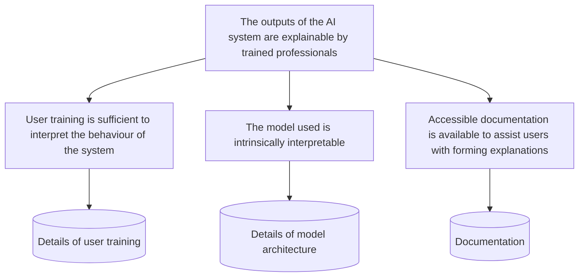

---
hide:
  - navigation
---

# About the Trustworthy and Ethical Assurance Platform

!!! info

    The Trustworthy and Ethical Assurance platform, or TEA Platform 🫖 for short, is
    an open-source and community-oriented tool that has been designed and developed by researchers at the
    Alan Turing Institute and University of York to support the process of
    developing and communicating trustworthy and ethical assurance cases.

{ align=right width="45%" }

To better understand the purpose and motivation of the TEA platform, we can consider the following question:

> How should researchers and developers provide assurance that some ethical goal has been achieved over the course of a designing, developing, and deploying a data-driven technology, such as a machine learning model or AI system?

This is not an easy question to answer! As we pick it apart, we realise there are many more questions that need to be addressed:

- Which ethical goals are relevant to the technology (e.g. fairness, explainability, safety, sustainability)?
- How are these goals defined in the context of the project?
- How can a project team provide justified evidence that these goals have been achieved?
- Who should be engaged with as part of this process, and how should this engagement be structured?

The TEA platform helps project teams and stakeholders—including researchers, developers, decision-makers, managers, auditors, regulators, and users—answer these questions in a systematic manner. However, different elements of the platform serve specific but complementary purposes.

## Key Elements of the TEA platform

We can think of the TEA platform in terms of three interlocking elements:

1. An interactive tool for building assurance cases
2. A set of educational resources that help users get the most out of the tool (e.g. user guides and documentation)
3. The community infrastructure that promotes open and collaborative practices

### Element 1: Interactive Assurance Tool

The main component of the TEA platform is the interactive tool that allows members of a project team to iteratively develop an *assurance case* using a graphical interface.

<!-- Insert screenshot of platform -->

In short, an assurance case presents an *argument*, in a logical and graphical format, about how an ethical goal has been achieved. The key to an assurance case is the structure of the argument.

At the top of an assurance case is a clear and accessible claim about the technology or system in question, which serves as the goal of the argument (i.e. the goal claim). Underneath this goal claim is a set of additional claims about specific properties of the project or system (i.e. property claims), which help specify the goal and demonstrate what actions or decisions have been taken to achieve the goal. And, at the base of the assurance case is the evidence that justifies the validity of the above claims.

Although there are additional elements beyond these three (see [here](guidance/components.md) for further details), these three central elements are vital for demonstrating to stakeholders that a system has been designed, developed, and deployed in a manner that is trustworthy and ethical. Figure 2 shows a simple (but incomplete) assurance case comprising these three elements.

*Figure 2. A simple assurance case showing a top-level goal claim, a set of three property claims, and corresponding evidence.*

### Element 2: User Guidance and Documentation

Although the logical structure of an assurance case is simple, the process of building and sharing an assurance case can be more involved.
As such, a significant element of the TEA platform is the user guidance and documentation that helps establish best practices and enhance the capabilities of teams.

Our user guidance and documentation is continuously evolving, and the following table provides an overview of what is currently available and in progress.[^gh_issues]

{{ read_csv('../module_tracker.csv') }}

[^gh_issues]: You can also see our GitHub issues for further details of other modules or sections that are `planned`, `in progress`, or `under review`: [https://github.com/alan-turing-institute/AssurancePlatform/issues?q=is%3Aissue+is%3Aopen+label%3Adocumentation](https://github.com/alan-turing-institute/AssurancePlatform/issues?q=is%3Aissue+is%3Aopen+label%3Adocumentation)

### Element 3: Community Infrastructure

A key part of trustworthy and ethical assurance is meaningful engagement with stakeholders and users.
For instance, a project team may believe that they have carried out the set of actions and decisions that are sufficient to justify a claim made about the fairness of an AI system.
However, the complexity of an ethical principles such as fairness means that it is easy to (unintentionally) overlook a core property that disproportionately affects a group of users (e.g. representativeness of data, equitable impact of a system).

Furthermore, our understanding of trustworthy and ethical assurance evolves as the capabilities of sociotechnical systems, such as AI systems or digital twins, also evolves.
Therefore, it is vital that the process of developing and communicating assurance cases, where possible, is done in an open and collaborative manner.

The benefits of this include:

- Community support for identifying and defining key ethical principles
- Sharing case studies and exemplary assurance cases that help promote consensus and best practices
- A collaborative approach to evaluating the strength and justifiability of assurance cases (e.g. identifying gaps or insufficient evidence)
- Open design and collaboration of new ideas and features to improve the TEA platform

If you want to learn more about how the TEA platform scaffolds community engagement, please read our community guide: [https://github.com/alan-turing-institute/AssurancePlatform/blob/main/CONTRIBUTING.md](https://github.com/alan-turing-institute/AssurancePlatform/blob/main/CONTRIBUTING.md).
