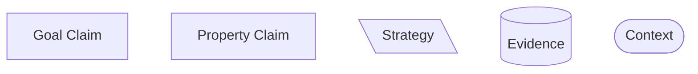
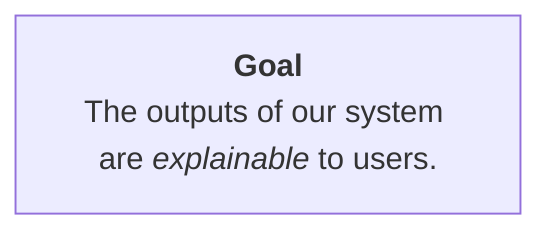
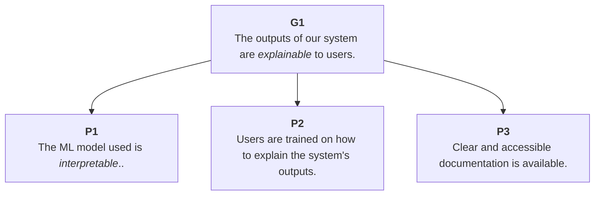
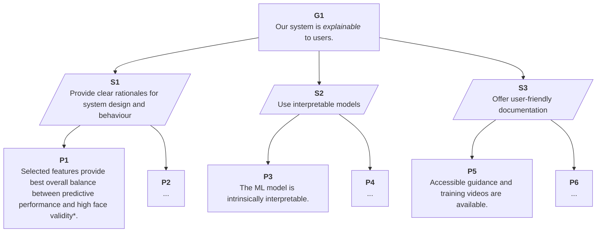
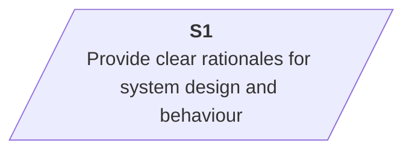
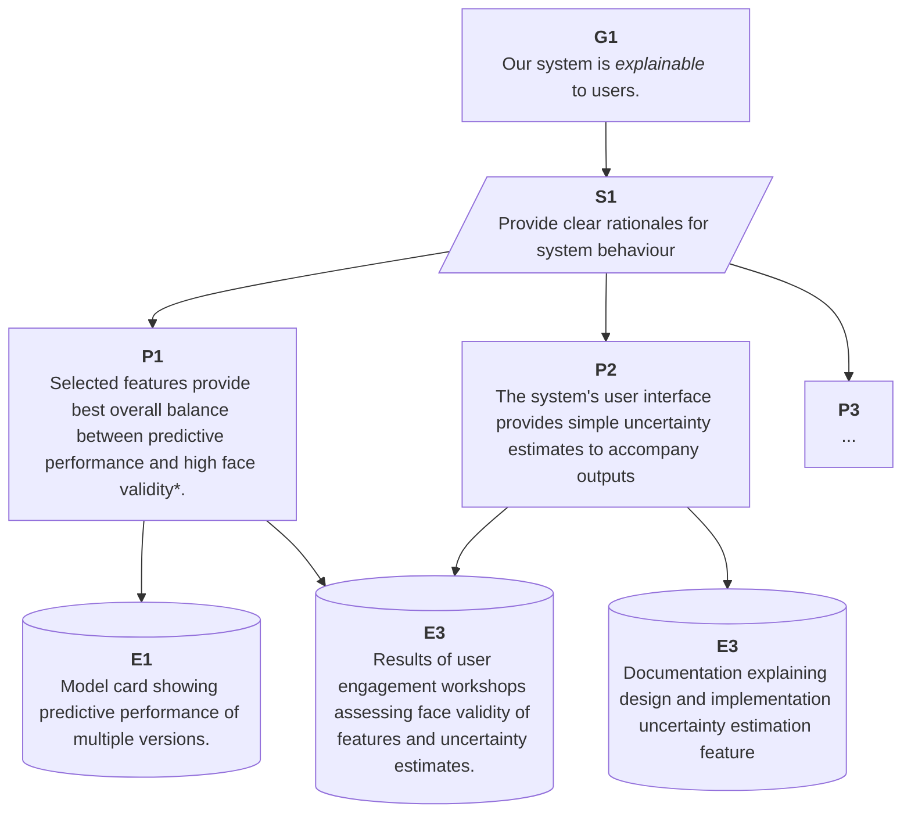
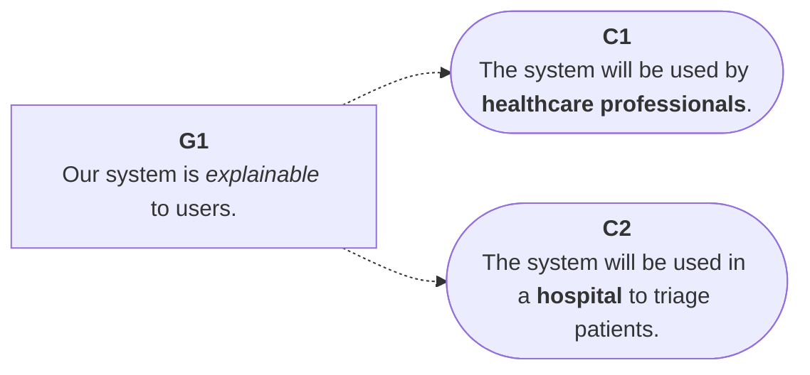
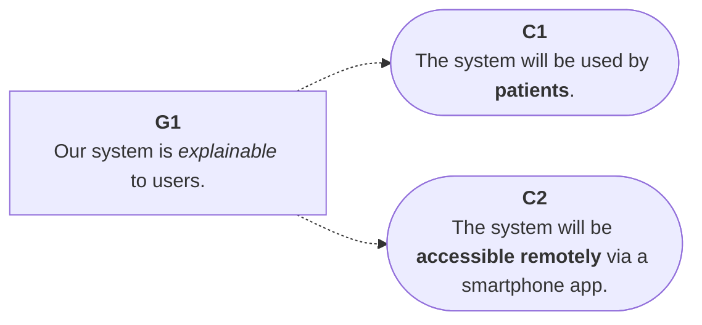
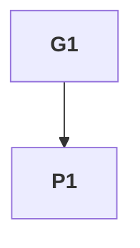
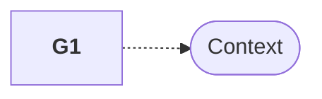

---
tags:
  - assurance
  - core elements
---

# Components of an Assurance Case

!!! info "Summary"

    In this section we will look at the core elements of an assurance case and how they relate to one another.

There are many ways to construct an assurance case and several standards exist
to help users adopt shared practices and ways of working. For instance, the
[Goal Structuring Notation](https://scsc.uk/r141C:1?t=1) (GSN) has thorough and
comprehensive documentation for building assurance cases that align with their
community standard.

Trustworthy and Ethical Assurance is inspired by GSN's form of argument-based
assurance, but aims to simplify the process of developing an argument and the
evidence that justifies it, in order to make the process more accessible for a
wider community of stakeholders and users. The trade-off is that assurance cases
developed using our platform are _less expressive_ than others but (hopefully)
easier to understand.

!!! warning "A Note on Terminology"

    An assurance case presents an *argument*. Here, the argument is the logical sequence of claims that serve as premises for the over-arching conclusion. The validity of the assurance case depends both on the structure and content of the claims (i.e. the argument), but also on the evidence that is offered to ground the argument.

All assurance cases contain the following core elements:

Let's look at each of these elements in turn.

## Core Elements

### Claims

There are two types of claims:

1. Goal Claims
2. Property Claims

#### Goal Claims

A _goal claim_ serves to direct the process of developing an assurance case
towards some value or principle that is desirable or significant. For instance,
it may be important to communicate how a product is 'Sustainable', how an
algorithmic decision-making system is 'Explainable', or how the deployment of
some service is 'Fair'. The type of goal chosen will determine and constrain the
set of lower-level property claims and evidence that are _relevant_ and
_necessary_ for the overall assurance case. As such, a goal claim should be the
first element to be established. However, like all elements, it can be
iteratively revised and refined as the assurance process develops.

Because a goal claim for will be _high-level_, it will not have the necessary
specificity to link directly to evidence. Consider the following example.

Here, _explainable_ is a broad goal that is insufficiently specified, and many
questions could remain:

- Who are the outputs explainable to? Experts or lay people?
- What techniques have been used to allow users to interpret the outputs of the
  system?
- Who is able to access information about how the system was designed if they
  are not satisfied with an automated explanation?
- How have you assessed the validity of the information presented to support
  explanations? Is there a level of uncertainty that needs to be communicated?

Resolving questions such as these requires the use of additional elements,
including lower-level _property claims_.

!!! info "Multiple Goals and Modular Arguments"

    In this section, we only discuss arguments with a single goal. However, nested (or, modular) assurance cases can also be developed where multiple goal claims serve as sub-claims into a broader argument that subsumes the lower-level arguments.

#### Property Claim(s)

Goal claims need to be succinct and accessible to set a clear vision or target
for the argument. However, this comes at the cost of _specificity_. For
instance, what does it mean to deploy a service in a fair manner, or to develop
an explainable system? Property claims help to answer such questions.

In one respect, property claims can be treated as lower-level goal claims[^gsn].
That is, when formulated they represent more specific aspirations that also need
to be established and justified. However, an assurance case may have only one
goal claim[^modularity], but will likely have many property claims.

Collectively, the property claims serve to establish the central argument for
how the goal claim has been established by detailing properties of a project or
the system that help justify why the top-level goal has been sufficiently
established. That is, they are the additional premises that support the
conclusion of the argument (i.e. the top-level goal claim). Consider the
following example.

[^gsn]:
    In the GSN standard, all claims are treated as goals and no distinction is
    made between goal claims and property claims. Our methodology maintains
    consistency with this standard, which is why property claims have the same
    type as goal claims, but adds an additional descriptive layer to better
    represent the ethical process of deliberation and reflection (see section on
    [Operationalising Principles](operationalising-principles.md)) <!-- @chrisdburr it looks like this document is missing! -->

[^modularity]: See earlier note about 'Multiple Goals and Modular Arguments'.

Identifying the necessary and sufficient set of property claims needed to
support an argument can be challenging[^resources]. Developing and defining a
_strategy_ can be a useful way to add supporting structure to an argument.

[^resources]:
    The TEA platform has a wide-range of tools and resources for supporting this
    reflective and deliberative process. See [here](#).

### Strategy

Understanding how a goal claim is jointly supported and specified by the
constituent property claims can be challenging without additional structure.
This is where strategy elements can be useful.

A strategy element in an assurance case makes explicit the reasoning or approach
used to _decompose_ a high-level goal claim into more specific property claims.
From the perspective of the team building the assurance case, strategy elements
outline how the team plan to demonstrate that a certain goal or claim is met by
breaking it up into sub-arguments.

Let's consider our running example again.

!!! warning "Goal Claim"

    Note this time that the goal claim `G1` has changed subtly to be more encompassing. Originally, the goal claim was focused just on the outputs of the system, but we can assume that by considering the argument more fully and identifying specific strategies, the project team have come to realise that the explainability of a system depends on more than just the individual outputs (e.g. classification decisions).

There are several benefits to making the over-arching argument's strategy
explicit:

- **Guiding the argument**: during iterative development, the set of strategy
  elements serve as placeholders that the project team can use to break down the
  complex task of decomposing goals. And, during communication, they can serve
  as a clear roadmap to help other stakeholders understand and follow their
  reasoning.
- **Facilitating engagement and evaluation**: external reviewers or stakeholders
  may wish to engage with or evaluate an assurance case, at different stages of
  development (e.g. during project development or compliance/auditing of the
  system). Understanding the strategy chosen by the project team is can help
  wider stakeholders assess whether the presented evidence is sufficient, if
  there are gaps in the argument, and, ultimately, help the project team and
  wider community develop more robust standards and best practices.
- **Clarifying case relationships**: strategy elements can connect multiple
  elements, such as goal claims to more detailed property claims. Leveraging
  this hierarchical structure ensures that all claims are supported by
  well-thought-out process of reasoning and deliberation, and can also help a
  project team identify relevant evidence to ground the overarching argument.

Let's now turn to consider evidence in more detail.

### Evidence

Evidence is what grounds an assurance case. Whereas goal claims orient and
direct an argument, strategies help scaffold the logic of an argument, and
property claims help specify and establish an argument, evidence is what
provides the basis for trusting the validity of the case as a whole.

The types of evidence that need to be communicated will depend on the claims
being put forward. For instance, if a claim is made about the attitudes of users
towards some system, then findings from a workshop or survey that explored these
attitudes may be needed. Alternatively, if the claim is about a model's
performance exceeding some threshold, then evidence about the test will be
needed (e.g. benchmarking scores and methodology).

Let's look at the section of our running example that addresses the following
strategy:

We can expand the set of property claims for this strategy and consider what
sorts of evidence may be suitable.

Similar to a legal case, where evidence needs to be admissible, relevant, and
reliable, there are also standards for which types of evidence are appropriate
in a given context. In some cases, technical standards may exist that can help
bolster the trustworthiness of an argument, by allowing a project team to show
how their actions adhere to standards set by an external community. In other
cases, consensus may only emerge through the communication and evaluation of the
evidence itself.

!!! info "Community Building"

    A key ambition of the TEA Platform is to help scaffold and support a flourishing community of practice that can drive forward the development of standards for evidence. For instance, as the repository of shared assurance cases grows, the community will be able to identify which forms of evidence others are using to justify arguments in different domains or use cases.

One final element remains to discuss: context. And, as many philosophers are
keen to point out, a lot can depend on the context.

## Context

There are various types of context statements that can be added to the core
elements of an assurance case. For instance, consider the following two
examples:

**Example 1**

**Example 2**

We leave it as a reflective exercise to the reader to consider how the two
different contexts will shape the types of claims, strategies, and evidence that
a project team would need to establish in the respective assurance cases.

## Links

There are two types of links that are used in Trustworthy and Ethical Assurance.

### Support Links

The primary link used in Trustworthy and Ethical assurance cases is a _support
link_. These links represent a uni-directional relationship between two
elements, such that the parent element is _supported by_ the child element.

They are rendered as follows:

!!! warning "Permitted Support Links"

    The TEA platform restricts a user's ability to add invalid support links between elements. However, for clarity, the following support links are valid:

    - Goal Claim to Strategy
    - Goal Claim to Property Claim
    - Strategy to Property Claim
    - Property Claim to Property Claim
    - Property Claim to Evidence

### Context Links

Context links provide additional information for relevant elements, which has a
constraining effect on the scope of the claim being made. For instance, goal
claims made about a system may be constrained by a specific use context (e.g. an
algorithm may operate fairly in the context of a highly constrained information
environment where input data follow a particular structure).

They are rendered as follows:

Some examples of contextual information that could be added include:

- Context of Use (e.g. specific environment, set of users)
- Description of technology or technique (e.g. class of algorithms)

!!! warning "Permitted Context Links"

    The TEA platform restricts a user's ability to add invalid context links between elements. However, for clarity, the following context links are valid:

    - Goal Claim to Context
    - Property Claim to Context
    - Strategy to Context
