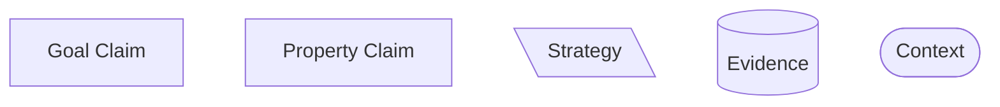
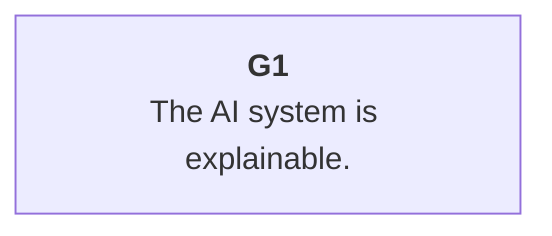
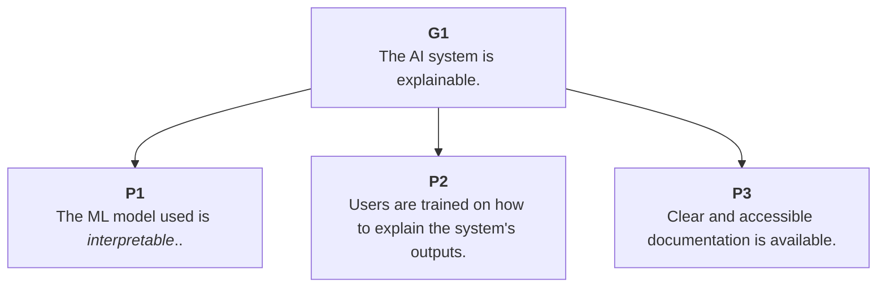
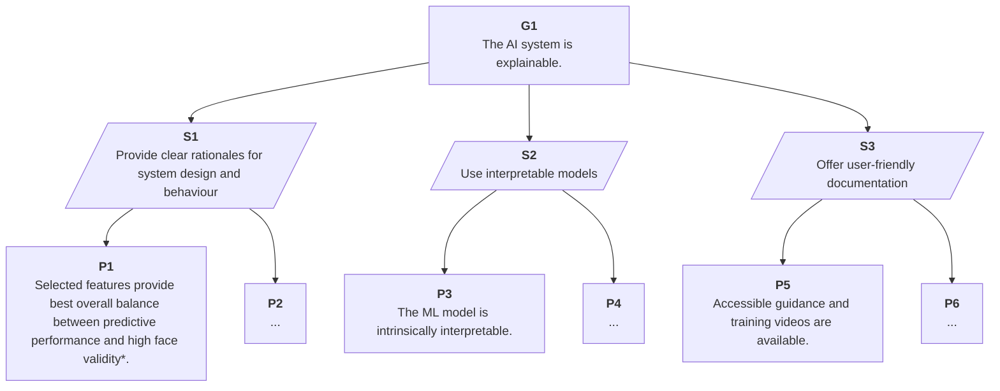
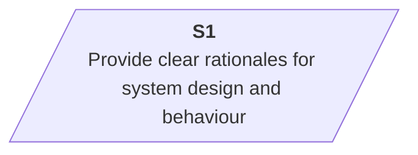
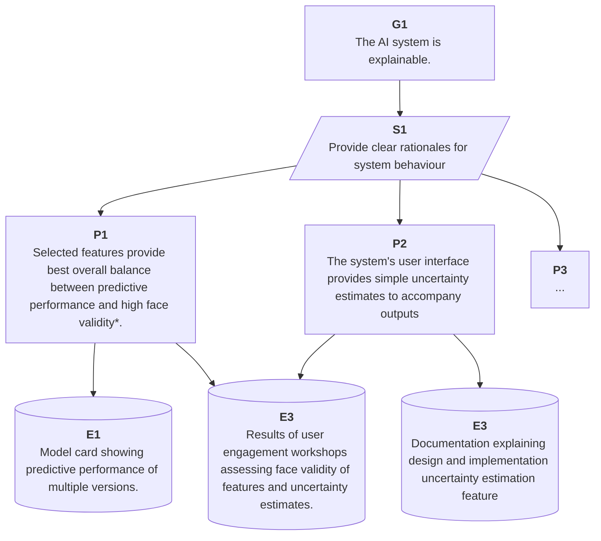
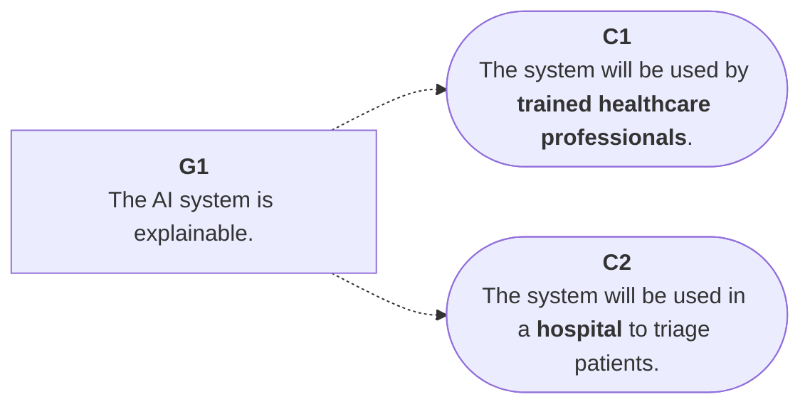
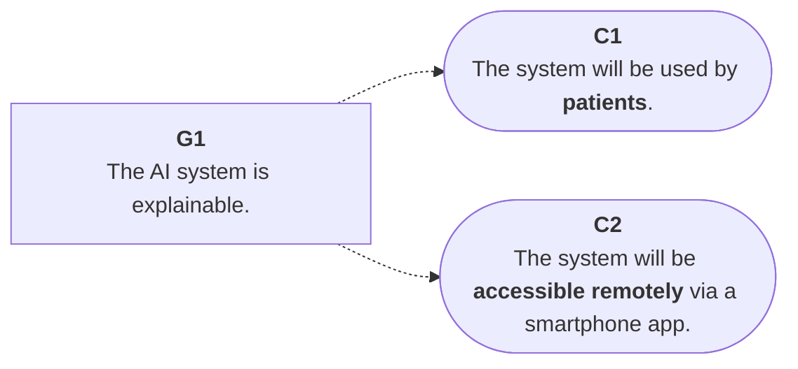
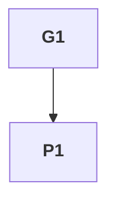
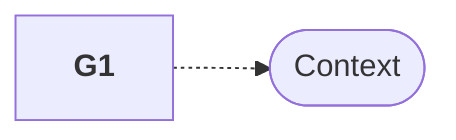

# Your First Taste of TEA—An Introduction to Trustworthy and Ethical Assurance

## What is assurance?

Assurance is about building trust.

Consider the following scenario.
You are in the market for a new car and go to a local dealership.
One of the sales advisors convinces you to buy a second hand car that later turns out to have an issue with the engine.
Frustrated, you take the car back and the sales advisor apologises.
They explain that all their second hand cars undergo a thorough assessment before they are placed on the market but, nevertheless, go on to process a return and get you a different car.
You are reassured, but only for a short period of time. 

Later on, the car turns out to have another problem with the engine—the same problem as before!
The sales advisor tries to convince you that this is just a series of unlucky
incidents, but without clear evidence to support their claim, this time around
you do not trust them and take your business elsewhere.

> Assurance involves providing *evidence* that help people understand and evaluate the _trustworthiness_ of a claim (or series of claims) about a system or technology.

In the above example, the sales advisor made claims about their cars being _reliable_ (i.e. undergoing a thorough assessment), but the claims they made about the assessment process were undermined by the contrary evidence (i.e. two unreliable cars).

The relationship between trust and assurance is significant in nearly all contexts, and particularly in safety-critical domains (e.g. health, energy).
Therefore, having clear methods, processes, and tools for providing justified assurance and building trust with stakeholders and users is crucial.
This is where Trustworthy and Ethical Assurance (TEA) comes in.

As a type of *argument-based assurance*, TEA provides clear and accessible methods, processes, and tools, which are brought together in a single platform (the TEA platform) to help teams demonstrate how a set of structured claims and evidence justify some goal.
Let's dig into this in more detail.

## What is argument-based assurance?

When a lawyer stands up in court to prosecute or defend a person, they present a case that is intended to convince a jury of the person's guilt or innocence.
To achieve this, they lay out a series of claims and supporting evidence, which collectively constitute an argument.
In a similar vein, argument-based assurance aims to present a reasoned and justified argument regarding some top-level claim (i.e. a goal).

The main argument presents the claims made about specific properties of a project or system (including aspects of the project governance or design), and the evidence that supports those claims. The relationships between the goal, the property claims, and the evidence is important, and the overall structure of an argument can be represented graphically to help make these relationships clear. 

For instance, consider the following toy example shown in Figure 1.

![[Screenshot 2024-03-27 at 13.29.15.png]]
*Figure 1. An illustrative example showing an incomplete assurance case that focuses on the goal of explainability.*

Figure 1 depicts a tree-like diagram, where the top-level element (`G1`) represents the goal of an assurance case.

> "The AI system is explainable."

Putting aside the issue of what this AI system does for a moment, it should be clear that to provide assurance for such a high-level goal is not easy.
Simply put, the goal is not sufficiently defined or specified.

Therefore, the next set of elements, `P1, ..., P3`, presents a series of lower-level claims made about properties of the project that developed the AI system, or the AI system itself. 
Each of these claims is linked to some evidence, `E1, ..., E3`, that is intended to justify the validity of the respective parent claim. For instance, in the case of `P1` and `E1`, whether the claim about the trained professionals being able to explain how the AI system operates is taken to depend on the results of a user study—presumably one that provides convincing evidence that trained professionals can indeed explain how the system functions.

The set of all property claims and evidence are taken to constitute *an argument* that supports the top-level goal.
Whether it does this successfully will depend on how well the argument is constructed.

TEA promotes and supports a process of critical reasoning, which is designed to create a convincing argument that articulates why a top-level goal is true (or, more precisely why it is *likely to be true*).

The final document is known as an assurance case, and is typically presented in a visually intuitive form that supports accessible communication and assists critical engagement.
For instance, if a claim is not supported by evidence, the resulting gap will be easy to spot.
In addition, whether an additional property claim is necessary can be inferred from the existing claims that are established.
And, furthermore, whether some evidence is strong enough to support a claim (or several claims) can be evaluated by considering the relationships that are presented.
As such, ABA helps teams and stakeholders consider both positive evidence as well as possible counterarguments, gaps, and uncertainties, offering mitigations for those when possible.

So far, we have only considered three elements—a top-level goal, a set of property claims, and evidence.
However, there are also several other elements of an assurance case, which can help users build a more structured and convincing argument.

## Core elements of an assurance case

All assurance cases contain the following core elements:

Let's look at each of these elements in turn.

### Claims

There are two types of claims:

1. Top-Level Goal Claim
2. Property Claims

#### Top-Level Goal Claim

A top-level _goal claim_ serves to direct the process of developing an assurance case
towards some value or principle that is desirable or significant.
For instance, it may be important to communicate how a product is 'Sustainable', how an
algorithmic decision-making system is 'Explainable', or how the deployment of
some service is 'Fair'.
The type of goal chosen will determine and constrain the set of lower-level property claims and evidence that are _relevant_ and _necessary_ for the overall assurance case.
As such, a goal claim should be the first element to be established.
However, like all elements, it can be iteratively revised and refined as the assurance process develops.

As already mentioned, because a goal claim will be _high-level_, it will not have the necessary specificity to link directly to evidence.
For instance, consider again the following goal claim.

Here, the _explainability_ of an AI system is a broad goal that is insufficiently specified, and many questions could remain:

- Who are the outputs of the system explainable to? Experts or lay people?
- What techniques have been used to allow users to interpret the outputs of the
  system?
- Who is able to access information about how the system was designed if they
  are not satisfied with an automated explanation?
- How have you assessed the validity of the information presented to support
  explanations? Is there a level of uncertainty that needs to be communicated?

Resolving questions such as these requires the use of additional elements, including lower-level _property claims_.

!!! info "Multiple Goals and Modular Arguments"

    In this section, we only discuss arguments with a single goal. However, nested (or, modular) assurance cases can also be developed where multiple goal claims serve as sub-claims into a broader argument that subsumes the lower-level arguments.

#### Property Claims

Goal claims need to be succinct and accessible to set a clear vision or target
for the argument.
However, this comes at the cost of _specificity_.
For instance, what does it mean to deploy a service in a fair manner, or to develop
an explainable system?
Property claims help to answer such questions.

In one respect, property claims can be treated as *lower-level goal claims*[^gsn].
That is, when formulated they represent more specific goals that also need
to be established and justified.
However, while an assurance case may only have one *top-level goal claim*[^modularity], it will have *many* property claims.

Collectively, property claims serve to establish the central argument for how a goal claim has been established by detailing properties of a project or the system that help justify why the top-level goal is likely to be true.
That is, they are additional premises that support the conclusion of the argument (i.e. the top-level goal claim). Consider the following example.

Identifying the necessary and sufficient set of property claims needed to
support an argument can be challenging[^resources].
Developing and defining a _strategy_ can be a useful way to add supporting structure (or, scaffolding) to an argument.

### Strategy

Understanding how a goal claim is jointly supported and specified by the constituent property claims can be challenging without additional structure.
This is where strategy elements can be useful.

A strategy element in an assurance case helps to make clear the reasoning or approach
used to _decompose_ a high-level goal claim into more specific property claims. 
From the perspective of the team building the assurance case, strategy elements
provide scaffolding or a blueprint for how the team plan to demonstrate that a certain goal or claim is met by breaking it up into sub-arguments.
From the perspective of an individual reviewing an assurance case, strategy elements help make the team's reasoning more transparent and accessible.

Let's consider our running example again.

There are several benefits to making the over-arching argument's strategy
explicit:

- **Guiding the argument**: during iterative development, the set of strategy elements serve as placeholders that the project team can use to break down the complex task of decomposing goals. And, during communication, they can serve as a clear roadmap to help other stakeholders understand and follow their reasoning.
- **Facilitating engagement and evaluation**: external reviewers or stakeholders may wish to engage with or evaluate an assurance case, at different stages of development (e.g. during project development or compliance/auditing of the system). Understanding the strategy chosen by the project team is can help wider stakeholders assess whether the presented evidence is sufficient, if there are gaps in the argument, and, ultimately, help the project team and wider community develop more robust standards and best practices.
- **Clarifying case relationships**: strategy elements can connect multiple elements, such as goal claims to more detailed property claims. Leveraging this hierarchical structure ensures that all claims are supported by well-thought-out process of reasoning and deliberation, and can also help a project team identify relevant evidence to ground the overarching argument.

Let's now turn to consider evidence in more detail.

### Evidence

Evidence is what grounds an assurance case.
Whereas goal claims orient and direct an argument, strategies help scaffold the logic of an argument, and property claims help specify and establish an argument, evidence is what provides the basis for trusting the validity of the case as a whole.
As the foundation of an assurance case, evidence is crucial!

The types of evidence that need to be communicated will depend on the claims being put forward.
For instance, if a claim is made about the attitudes of users towards some system, then findings from a workshop or survey that explored these attitudes may be needed.
Alternatively, if the claim is about a model's performance exceeding some threshold, then evidence about the test will be needed (e.g. benchmarking scores and methodology).

Let's look at the section of our running example that addresses the following strategy:

We can expand the set of property claims for this strategy and consider what
sorts of evidence may be suitable.

Similar to a legal case, where evidence needs to be admissible, relevant, and reliable, there are also standards for which types of evidence are appropriate in a given context. In some cases, technical standards may exist that can help bolster the trustworthiness of an argument, by allowing a project team to show how their actions adhere to standards set by an external community.
In other cases, consensus may only emerge through the communication and evaluation of the evidence itself.

One final element remains to discuss: context.
And, as many philosophers are keen to point out, a lot can depend on the context.

## Context

Assurance is also anchored in a specific context.
In TEA, the context is made explicit by using context elements.

For instance, consider the following two examples:

**Example 1**

**Example 2**

It should be clear why these two contexts would make a difference in the subsequent claims and evidence needed to justify the goal.

An AI system used by a trained healthcare professionals within a hospital environment ought not be designed in the same ways as one used by patients through a smartphone.
The former environment is much more constrained and regulated than the latter, and these constraints make a big difference.

If this context was not provided, it would be impossible to evaluate or verify the validity or the argument.

## Links

In addition to the above elements, there are two types of links that are used in Trustworthy and Ethical Assurance.

### Support Links

The primary link used in Trustworthy and Ethical assurance cases is a _support
link_.
These links represent a uni-directional relationship between two
elements, such that the parent element is _supported by_ the child element.

They are rendered as follows:

!!! warning "Permitted Support Links"

    The TEA platform restricts a user's ability to add invalid support links between elements. However, for clarity, the following support links are valid:

    - Goal Claim to Strategy
    - Goal Claim to Property Claim
    - Strategy to Property Claim
    - Property Claim to Property Claim
    - Property Claim to Strategy
    - Property Claim to Evidence

### Context Links

Context links provide additional information for relevant elements, which has a
constraining effect on the scope of the claim being made. For instance, goal
claims made about a system may be constrained by a specific use context (e.g. an
algorithm may operate fairly in the context of a highly constrained information
environment where input data follow a particular structure).

They are rendered as follows:

Some examples of contextual information that could be added include:

- Context of Use (e.g. specific environment, set of users)
- Description of technology or technique (e.g. class of algorithms)

!!! warning "Permitted Context Links"

    The TEA platform restricts a user's ability to add invalid context links between elements. However, for clarity, the following context links are valid:

    - Goal Claim to Context
    - Property Claim to Context
    - Strategy to Context

One of the key strengths of this approach is its ability to facilitate clear communication among stakeholders, including researchers, developers, regulators, and system users.
By making assumptions explicit and providing a structured framework for critical reasoning, ABA facilitates a transparent, understandable and reproducible assurance process.
It also offers a flexible and extensible way to integrate various types of evidence (and [standards](standards.md)), such as empirical data, expert opinion, and formal methods, into a cohesive argument.

However, ABA is not without its challenges[^habli].
Constructing a rigorous argument requires significant expertise, can be time-consuming, and the quality of the argument is heavily dependent on the strength and sufficiency of the underlying evidence.
Furthermore, there are also concerns regarding how to update or modify assurance arguments as systems evolve or when new information becomes available.
These topics are explored further in later modules.

[^gsn]:
    In the GSN standard, all claims are treated as goals and no distinction is
    made between goal claims and property claims. Our methodology maintains
    consistency with this standard, which is why property claims have the same
    type as goal claims, but adds an additional descriptive layer to better
    represent the ethical process of deliberation and reflection (see section on
    [Operationalising Principles](operationalising-principles.md)) <!-- @chrisdburr it looks like this document is missing! -->

[^modularity]: See earlier note about 'Multiple Goals and Modular Arguments'.

[^habli]:
    Habli, I., Alexander, R., & Hawkins, R. D. (2021). Safety Cases: An
    Impending Crisis? In Safety-Critical Systems Symposium (SSS’21).
    https://core.ac.uk/download/pdf/363148691.pdf

[^resources]:
    The TEA platform has a wide-range of tools and resources for supporting this
    reflective and deliberative process. See [here](#).