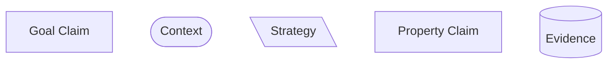
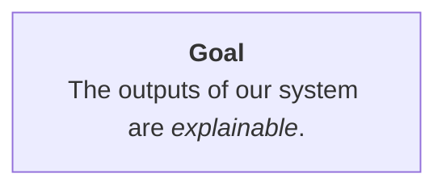
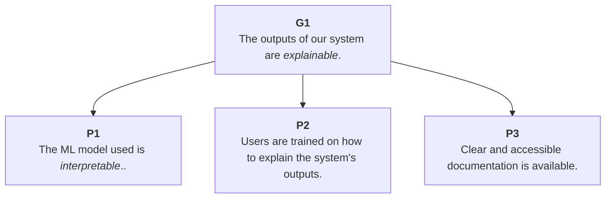
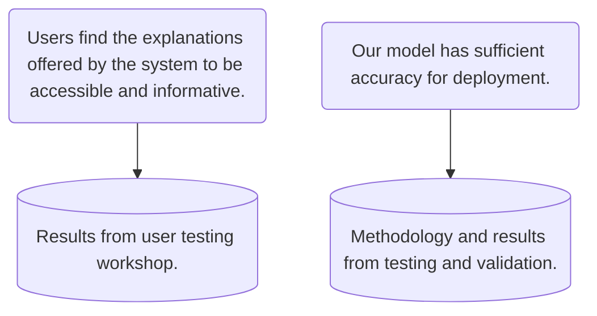
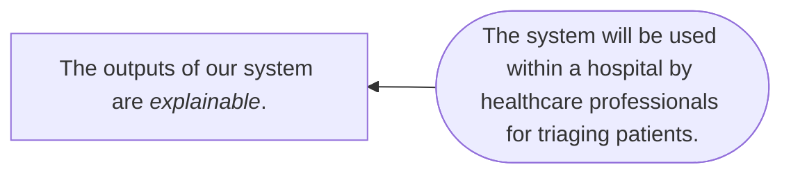
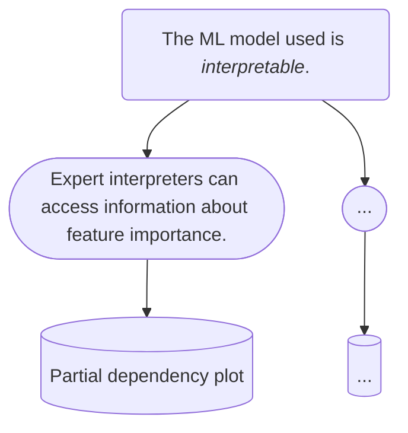

# Components of an Assurance Case

!!! info "Summary"

    In this section we will look at the core elements of an assurance case and how they relate to one another.

There are many ways to construct an assurance case and several standards exist to help users adopt shared practices.
For instance, the [Goal Structuring Notation](https://scsc.uk/r141C:1?t=1) has thorough and comprehensive documentation for building assurance cases that align with their community standard.

Trustworthy and Ethical Assurance is inspired by GSN's form of argument-based assurance, but aims to simplify the process of developing, communicating, and evaluating an argument and the evidence that justifies it, in order to make the process more open and inclusive to a broader community of stakeholders and users.
That is, we prioritise *accessibility* and *simplicity*.
The trade-off is that assurance cases developed using our platform are *less expressive* than others, but (hopefully) easier to understand.

!!! warning "A Note on Terminology"

    An assurance case presents an *argument*. Here, the argument is the logical sequence of claims that serve as premises for the over-arching conclusion. The validity of the assurance case depends both on the structure and content of the claims (i.e. the argument), but also on the evidence that is offered to ground the argument.

All assurance cases contain the following core elements:

Let's look at each of these elements in turn.

## Core Elements

### Claims

There are two types of claims:

1. Goal Claims
2. Property Claims

#### Goal Claims

A *goal claim* serves to direct the process of developing an assurance case towards some value or principle that is desirable or significant.
For instance, it may be important to communicate how a product is 'Sustainable', how an algorithmic decision-making system is 'Explainable', or how the deployment of some service is 'Fair'.
The type of goal chosen will determine the set of lower-level property claims and evidence that are *relevant* and *necessary* for the overall assurance case.
As such, a goal claim should be the first element to be established.
Although, like all elements, it can be iteratively revised and refined as the assurance process develops.

Because a goal claim for will be *high-level*, it will not have the necessary specificity to link directly to evidence.
Consider the following example.

Here, *explainable* is a broad goal that is insufficiently operationalised or specified.
Resolving this requires the use of additional elements.

!!! info "Multiple Goals and Modular Arguments"

    In this section, we only discuss arguments with a single goal. However, nested (or, modular) assurance cases can also be developed where multiple goal claims serve as sub-claims into a broader argument that subsumes the lower-level arguments.

#### Property Claim(s)

Goal claims need to be succinct and accessible.
However, this comes at the cost of *specificity*.
For instance, what does it mean to deploy a service in a fair manner, or to develop an explainable system?
Property claims help to answer such questions.

In one respect, property claims can be treated as lower-level goals[^gsn].
That is, when formulated they represent aspirations that may need to be established and justified through linking to evidence.

[^gsn]: In the GSN standard, all claims are treated as goals and no distinction is made between goal claims and property claims. Our methodology maintains consistency with this standard, which is why property claims have the same type as goal claims, but adds an additional descriptive layer to better represent the ethical process of deliberation and reflection (see section on [Operationalising Principles](operationalising-principles.md))

An assurance case may have only one goal claim[^modularity], but multiple property claims.
Collectively, the property claims serve to establish the central argument for how the goal claim has been established by detailing properties of a project or the system that help justify why the top-level goal has been sufficiently established.
That is, they are the additional premises that support the conclusion.
Consider the following example.

### Strategy

[...]

### Evidence

Evidence is what grounds an assurance case.
Whereas goal claims orient a case and property claims help specify and establish an argument, evidence is what provides the basis for trusting the validity of the case as a whole.

The types of evidence that need to be communicated will depend on the claims being put forward.
For instance, if a claim is made about user's attitudes towards some technology or system, then findings from a user workshop may be needed.
Alternatively, if the claim is about a model's performance exceeding some threshold, then evidence about the test will be needed (e.g. benchmarking scores and methodology).

!!! info "Evidential Standards"

    Similar to a legal case, where evidence needs to be admissible, relevant, and reliable, there are also standards for which types of evidence are appropriate in a given context.
    
    In some cases, technical standards may exist that can help bolster the trustworthiness of an argument, by allowing a project team to show how their actions adhere to standards set by an external community.
    
    In other cases, consensus may only emerge through the communication and evaluation of the evidence itself.

## Context

There are various types of context statements that can be added to the core elements of an assurance case.
For instance, consider the following example:

## Links

There are two types of links that are used in Trustworthy and Ethical Assurance.

### Support Links

The primary link used in Trustworthy and Ethical assurance cases is a *support link*.
These links represent a uni-directional relationship between two elements, such that the parent element is *supported by* the child element.

<!-- add more information -->

They are rendered as follows:

<!-- add image -->

!!! warning "Permitted Support Links"

    The TEA platform restricts a user's ability to add invalid support links between elements. However, for clarity, the following support links are valid:

        - Goal Claim to Strategy
        - Goal Claim to Property Claim
        - Strategy to Property Claim
        - Property Claim to Property Claim
        - Property Claim to Evidence 

### Context Links

Context links provide additional information for relevant elements, which has a constraining effect on the scope of the claim being made.
For instance, goal claims made about a system may be constrained by a specific use context (e.g. an algorithm may operate fairly in the context of a highly constrained information environment where input data follow a particular structure).

They are rendered as follows:

<!-- add image -->

Some examples of contextual information that could be added include:

- Context of Use (e.g. specific environment, set of users)
- Description of technology or technique (e.g. class of algorithms)

!!! warning "Permitted Context Links"

    The TEA platform restricts a user's ability to add invalid context links between elements. However, for clarity, the following context links are valid:

        - Goal Claim to Context
        - Property Claim to Context
        - Strategy to Context

## Optional Elements

#### Evidential Claims

If the rationale for selecting some evidence to support a specific property claim (or set of claims) is not clear, an intermediate 'evidential claim' may be required.

For instance, the relevance of a partial dependency plot as supporting evidence for how a machine learning model is interpretable may be clear to some stakeholders, but a) this depends on prior expertise and b) may not address further questions, such as why individual feature importance is sufficient for establishing interpretability.

An evidential claim would help provide further clarity, by making explicit any assumptions made by the project team (e.g. interpretations of the system's behaviour will only be undertaken by trained experts).

