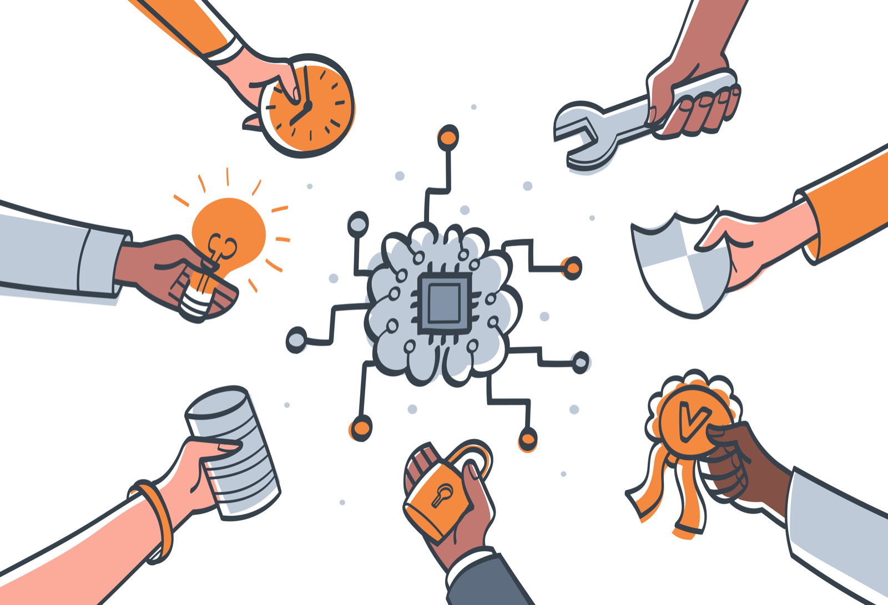

---
tags:
  - Introductory Resource
---

# What is Trustworthy and Ethical Assurance?

Assurance is about building trust.

Consider the following scenario. You are in the market for a new car and go to a
local dealership. One of the sales advisors convinces you to buy a second hand
car that later turns out to have an issue with the engine. Frustrated, you take
the car back and the sales advisor apologises. They explain that all their
second hand cars undergo a thorough assessment before they are placed on the
market but, nevertheless, go on to process a return and get you a different car. You are
reassured and happy, but only for a short period of time. Yet again, the car
turns out to have a problem with the engine—the same problem as before! The
sales advisor tries to convince you that this is just a series of unlucky
incidents, but without clear evidence to support their claims, this time around you do not trust
them and take your business elsewhere.

> Assurance involves communicating reasons and evidence that help people
> understand and evaluate the _trustworthiness_ of a claim (or series of claims)
> about a system or technology.

In the above example, the sales advisor needed to provide assurance that their
cars were _safe_ or _reliable_, but the claims they made about the assessment
process were undermined by the contrary evidence (i.e. two unreliable cars).

In a different scenario, things may go differently. For instance, you may have
a higher level of trust with friends or other professionals (e.g. doctors,
teachers) than with car sales persons. And, as such, you may be more likely to
accept claims in the absence of evidence or in spite of repeated instances of
contrary evidence. However, the relationship between trust and assurance is
significant in nearly all contexts, and especially so in some domains (e.g.
safety-critical engineering).

Therefore, having clear methods, processes, and tools for communicating
assurance and building trust is crucial. And, this is increasingly important in
the design, development, and deployment of data-driven technologies.

## Building Trust and Communicating Trustworthiness for Data-Driven Technologies

Trustworthy and Ethical Assurance could apply to many systems, but the TEA platform specifically addresses data-driven technologies, such as artificial intelligence or digital twins.

There are many benefits and risks associated with the design, development, and
deployment of data-driven technologies. And, therefore, many organisations and companies
find themselves in a situation of needing to communicate to customers, users, or
stakeholders how they have maximised the benefits and minimised the risks
associated with their product, service, or system. 

For example, an organisation building an autonomous vehicle may need to explain how their system is safe,
secure, fair, explainable, among other goals. How they achieve this will depend
on myriad contextual factors, including who they are communicating with (e.g.
regulators, potential customers).

Consider the goal of _safety_ with respect to the following questions:

- _How was the performance of the autonomous vehicle evaluated, and how will it be
  monitored?_ There are many metrics that can be used to evaluate the
  performance of an autonomous vehicle, including metrics that assess the
  performance of components of the vehicle such as the object recognition system
  (e.g. its accuracy, robustness, interpretability) as well as metrics that
  consider broader societal or environmental impact (e.g. sustainability,
  usability and accessibility).
- _Who carried out processes such as failure mode and effects analysis or
  stakeholder engagement?_ Diverse and inclusive teams can help reduce the
  likelihood of unintended consequences, especially those that may arise due to
  the presence of overlooked biases in the system (e.g. how were trade-offs in
  the design process handled and who was consulted).
- _Who will use the system?_ Whether a system is safe depends, in part, on who
  the users are (e.g. trained professionals versus members of the public)—a key
  challenge in the area of _human factors_ research.

These are just three examples of how claims made about the _safety_ of a system,
in response to a small set of possible questions, are highly contextual. If we
were to consider different goals (e.g. fairness, explainability) or different
areas of application (e.g. healthcare, defence and security), the types of
claims that would be needed to provide assurance for the goal in question could
be very different.

And yet, in spite of the contextual variation, there are similarities that span
the assurance of data-driven technologies, both within and between different
domains. There are, for instance, a recurring set of goals (or, principles) that
people emphasise when asked about the _ethical_ or _societal_ issues related to
data-driven technologies (e.g. fairness and bias, transparency and
explainability)[^principles]. And, furthermore, there is a growing set of techniques
and practices in place for building trust through open, transparent and accessible
forms of communication [^ttw].

[^principles]: Floridi, L., & Cowls, J. (2019). A Unified Framework of Five Principles for AI in Society. Harvard Data Science Review, 1(1). https://doi.org/10.1162/99608f92.8cd550d1

[^ttw]: The Turing Way Community. (2022). The Turing Way: A handbook for reproducible, ethical and collaborative research. Zenodo. doi: 10.5281/zenodo.3233853.

Trustworthy and ethical assurance is a framework that is anchored in these
similarities and existing techniques, but also recognises the importance of
understanding variation and difference. At the centre of this framework is a
_methodology_ and _tool_ for building _assurance cases_. These assurance cases
communicate how some ethical goal has been established within the context of the
design, development, or deployment of a data-driven technology. The methodology
serves as a guide for developing the cases, while the platform helps to build
and communicate them with the wider community or stakeholders.

The remaining parts of this section provide further context to help situate and motivate trustworthy and ethical assurance. However, if you'd prefer to jump straight in, you can jump to our [user guidance](user-guidance/index.md) section instead.
