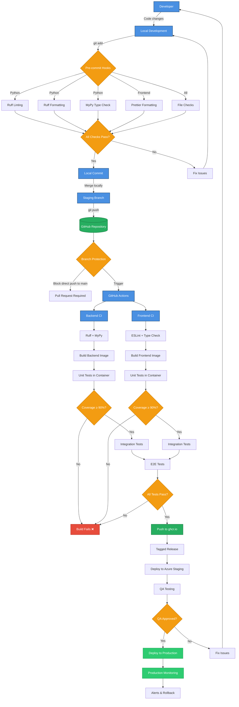

# CI/CD Pipeline Overview

The TEA Platform CI/CD pipeline follows a GitOps approach with multiple quality gates and automated deployments to staging and production environments.

## Pipeline Stages

### 1. Local Development & Pre-commit

Before code reaches the repository, local quality checks ensure standards are met:

- **Python**: Ruff (linting) and MyPy (type checking)
- **Frontend**: Prettier (formatting), ESLint (linting), TypeScript checks
- **General**: File size limits, merge conflict markers, trailing whitespace

### 2. Branch Strategy

- **Feature branches**: Individual developer work
- **Staging branch**: Integration and testing
- **Main branch**: Production-ready code (protected)

### 3. Continuous Integration

GitHub Actions workflows run on every push:

#### Backend Pipeline
1. **Code Quality**: Ruff and MyPy checks
2. **Docker Build**: Multi-platform image creation
3. **Unit Tests**: PyTest with 90% coverage requirement
4. **Integration Tests**: API and database tests

#### Frontend Pipeline
1. **Code Quality**: ESLint, TypeScript checks
2. **Docker Build**: Next.js production build
3. **Unit Tests**: Component and hook tests (90% coverage)
4. **Integration Tests**: Page and API route tests

### 4. End-to-End Testing

After both backend and frontend pass their individual tests:
- Playwright/Cypress tests for critical user journeys
- Performance benchmarks
- Security scanning

### 5. Container Registry

Successful builds are pushed to GitHub Container Registry (ghcr.io):
- Tagged with semantic version
- Multi-platform support (amd64, arm64)
- Cached for faster builds

### 6. Deployment

#### Staging Environment
- Automated deployment on successful builds
- Full environment matching production
- Used for QA and stakeholder review

#### Production Environment
- Requires manual approval after QA
- Blue-green deployment strategy
- Automatic rollback on errors

## Quality Gates

Each stage acts as a quality gate:

1. **Pre-commit**: Catches issues before commit
2. **Branch Protection**: Prevents direct pushes to main
3. **CI Checks**: Must pass linting and formatting
4. **Test Coverage**: Minimum 90% coverage required
5. **Integration Tests**: All API endpoints tested
6. **E2E Tests**: Critical paths verified
7. **QA Approval**: Human verification in staging

## Tools & Technologies

- **Version Control**: Git, GitHub
- **CI/CD**: GitHub Actions
- **Container Registry**: GitHub Container Registry (ghcr.io)
- **Testing**: PyTest (backend), Jest/Vitest (frontend), Playwright (E2E)
- **Code Quality**: Ruff, MyPy, ESLint, Prettier
- **Deployment**: Docker, Azure App Service
- **Monitoring**: Azure Application Insights

## Environment Variables

The pipeline manages environment-specific configurations:

- **Development**: Local `.env.local` files
- **CI/CD**: GitHub Secrets
- **Staging/Production**: Azure App Service settings

## Security Considerations

- Secrets never committed to repository
- Environment variables injected at build/runtime
- Container images scanned for vulnerabilities
- SAST/DAST tools in pipeline
- Least-privilege access for deployments

## Rollback Strategy

In case of issues:

1. **Automatic**: Health checks trigger auto-rollback
2. **Manual**: Previous versions available in registry
3. **Database**: Migration rollback scripts maintained
4. **Feature Flags**: Gradual rollout capabilities
