# CI/CD Pipeline Overview

The TEA Platform CI/CD pipeline follows a streamlined two-gate GitOps approach with automated quality checks and deployments to Azure staging and production environments.

```mermaid
graph TB
    %% Developer workflow
    Dev[Developer] -->|Code changes| LocalDev[Local Development]
    LocalDev -->|git add| PreCommit{Pre-commit Hooks}

    %% Gate 1: Pre-commit checks (Fast, Local)
    PreCommit -->|Python| RuffFormat[Ruff Format]
    PreCommit -->|All| FileChecks[Syntax & File Checks]
    
    RuffFormat --> CommitReady
    FileChecks --> CommitReady

    CommitReady{Checks Pass?} -->|Yes| LocalCommit[Local Commit]
    CommitReady -->|No| FixIssues[Fix Issues]
    FixIssues --> LocalDev

    %% Git workflow
    LocalCommit -->|git push| RemoteRepo[(GitHub Repository)]

    %% Gate 2: GitHub Actions (Comprehensive)
    RemoteRepo --> BranchProtection{Branch Protection}
    BranchProtection -->|Trigger| GitHubActions[GitHub Actions]

    %% CI Pipeline (ci.yaml)
    GitHubActions --> CIPipeline[CI Pipeline]
    CIPipeline --> ParallelChecks{Parallel Execution}
    
    %% Parallel quality checks
    ParallelChecks --> BackendQuality[Backend: Ruff + MyPy]
    ParallelChecks --> FrontendQuality[Frontend: Ultracite + TSC]
    ParallelChecks --> BackendUnitTests[Backend: Unit Tests]
    ParallelChecks --> FrontendUnitTests[Frontend: Unit Tests]

    %% Coverage gates
    BackendUnitTests --> BackendCoverage{Coverage ≥ 90%?}
    FrontendUnitTests --> FrontendCoverage{Coverage ≥ 90%?}
    BackendQuality --> QualityGate{Quality Pass?}
    FrontendQuality --> QualityGate

    BackendCoverage -->|No| BuildFails[Build Fails ❌]
    FrontendCoverage -->|No| BuildFails
    QualityGate -->|No| BuildFails

    %% Integration Pipeline (integration-deploy.yaml)
    BackendCoverage -->|Yes| IntegrationPipeline[Integration Pipeline]
    FrontendCoverage -->|Yes| IntegrationPipeline
    QualityGate -->|Yes| IntegrationPipeline

    IntegrationPipeline --> DockerBuild[Build Containers]
    DockerBuild --> IntegrationTests[Integration Tests]
    IntegrationTests --> AllTestsPass{All Tests Pass?}
    AllTestsPass -->|No| BuildFails
    AllTestsPass -->|Yes| PushRegistry[Push to ACR]

    %% Deployment
    PushRegistry --> DeployStaging[Deploy to Staging]
    DeployStaging --> SmokeTests[Smoke Tests]
    SmokeTests --> StagingReady[Staging Ready]

    %% Production Release (release.yaml)
    StagingReady --> ManualApproval{Manual Approval}
    ManualApproval -->|Approved| DeployProd[Deploy to Production]
    ManualApproval -->|Rejected| FixIssues

    %% Monitoring
    DeployProd --> Monitor[Production Monitoring]
    Monitor --> Alerts[Alerts & Rollback]

    %% Styling
    classDef process fill:#4A90E2,stroke:#2E5C8A,stroke-width:2px,color:#fff
    classDef decision fill:#F39C12,stroke:#D68910,stroke-width:2px,color:#fff
    classDef storage fill:#27AE60,stroke:#1E8449,stroke-width:2px,color:#fff
    classDef fail fill:#E74C3C,stroke:#C0392B,stroke-width:2px,color:#fff
    classDef success fill:#2ECC71,stroke:#27AE60,stroke-width:2px,color:#fff
    classDef gate fill:#9B59B6,stroke:#8E44AD,stroke-width:3px,color:#fff

    class Dev,LocalDev,LocalCommit,GitHubActions,CIPipeline,IntegrationPipeline process
    class PreCommit,CommitReady,BranchProtection,ParallelChecks,BackendCoverage,FrontendCoverage,QualityGate,AllTestsPass,ManualApproval decision
    class RemoteRepo,PushRegistry storage
    class BuildFails fail
    class DeployProd,Monitor,StagingReady success
    class PreCommit,CIPipeline gate
```



## Two-Gate Architecture

The pipeline implements a clean two-gate system for maximum transparency and efficiency:

### Gate 1: Pre-commit Hooks (Fast, Local)

Minimal checks that run in under 5 seconds:

- **Python**: Ruff formatting only
- **General**: JSON/YAML syntax, merge conflicts, large files
- **Purpose**: Catch obvious issues before commit

### Gate 2: GitHub Actions (Comprehensive, Container-based)

Three streamlined workflows handle all CI/CD needs:

#### 1. `ci.yaml` - Continuous Integration
Runs on every push and PR:
- **Parallel Execution**:
  - Backend: Ruff linting + MyPy type checking + Unit tests
  - Frontend: Ultracite linting + TypeScript checking + Unit tests
- **Coverage Requirements**: 90% for both backend and frontend
- **Fast Feedback**: Results in under 10 minutes

#### 2. `integration-deploy.yaml` - Integration & Deployment
Runs on main/staging branches:
- **Docker Builds**: Optimized multi-stage builds
- **Integration Tests**: Full stack with PostgreSQL and Redis
- **Azure Deployment**: Automatic to staging environment
- **Smoke Tests**: Verify deployment health

#### 3. `release.yaml` - Production Release
Triggered by version tags:
- **Manual Approval**: Required gate before production
- **Blue-Green Deployment**: Zero-downtime releases
- **Rollback Ready**: Automatic on failure

## Branch Strategy

- **Feature branches**: Developer work (PRs to main)
- **Main branch**: Always deployable (auto-deploys to staging)
- **Version tags**: Production releases (e.g., v1.2.3)

## Key Improvements

### Simplified Configuration
- Pre-commit: Only essential checks (no type checking)
- Workflows: Reduced from 6 to 3 files
- Clear separation of concerns

### Performance Optimizations
- Parallel job execution
- Docker layer caching
- Dependency caching
- Test result caching

### Developer Experience
- Fast local feedback (< 5 seconds)
- Clear error messages
- Predictable pipeline behavior
- No redundant checks

## Quality Gates

The two-gate system enforces quality at each stage:

### Gate 1 (Pre-commit)
- **Format Check**: Python code properly formatted
- **Syntax Validation**: No invalid JSON/YAML
- **File Safety**: No large files or merge conflicts

### Gate 2 (GitHub Actions)
- **Code Quality**: Linting and type checking pass
- **Test Coverage**: Minimum 90% coverage enforced
- **Integration Tests**: Full stack verification
- **Build Success**: Docker images build correctly
- **Deployment Health**: Staging smoke tests pass

## Tools & Technologies

### Version Control & CI/CD
- **Git & GitHub**: Source control with branch protection
- **GitHub Actions**: Three workflow files for all CI/CD
- **Azure Container Registry**: Production image storage

### Quality Tools
- **Backend**: Ruff (formatting/linting), MyPy (type checking), PyTest (testing)
- **Frontend**: Ultracite (formatting/linting), TypeScript (type checking), Vitest (testing)
- **Pre-commit**: Minimal hooks for fast local checks

### Infrastructure
- **Docker**: Multi-stage builds for efficient images
- **Azure App Service**: Staging and production hosting
- **PostgreSQL & Redis**: Database and caching services
- **Azure Application Insights**: Production monitoring

## Environment Variables

The pipeline manages environment-specific configurations:

- **Development**: Local `.env.local` files
- **CI/CD**: GitHub Secrets
- **Staging/Production**: Azure App Service settings

## Security Considerations

- Secrets never committed to repository
- Environment variables injected at build/runtime
- Container images scanned for vulnerabilities
- SAST/DAST tools in pipeline
- Least-privilege access for deployments

## Workflow Files

### `ci.yaml`
```yaml
on:
  push:
    branches: ['**']
  pull_request:
    branches: ['**']

jobs:
  backend-checks:    # Ruff, MyPy, PyTest
  frontend-checks:   # Biome, TSC, Vitest
  report-coverage:   # Upload to Codecov
```

### `integration-deploy.yaml`
```yaml
on:
  push:
    branches: [main, staging]
  workflow_run:
    workflows: ["CI Pipeline"]
    types: [completed]

jobs:
  build-images:      # Docker build & push
  integration-tests: # Full stack tests
  deploy-staging:    # Azure deployment
  smoke-tests:       # Health checks
```

### `release.yaml`
```yaml
on:
  push:
    tags: ['v*.*.*']

jobs:
  create-release:    # GitHub release
  deploy-approval:   # Manual gate
  deploy-production: # Azure production
  verify-deployment: # Production checks
```

## Rollback Strategy

In case of issues:

1. **Automatic**: Health checks trigger auto-rollback
2. **Manual**: Previous versions available in registry
3. **Database**: Migration rollback scripts maintained
4. **Feature Flags**: Gradual rollout capabilities
